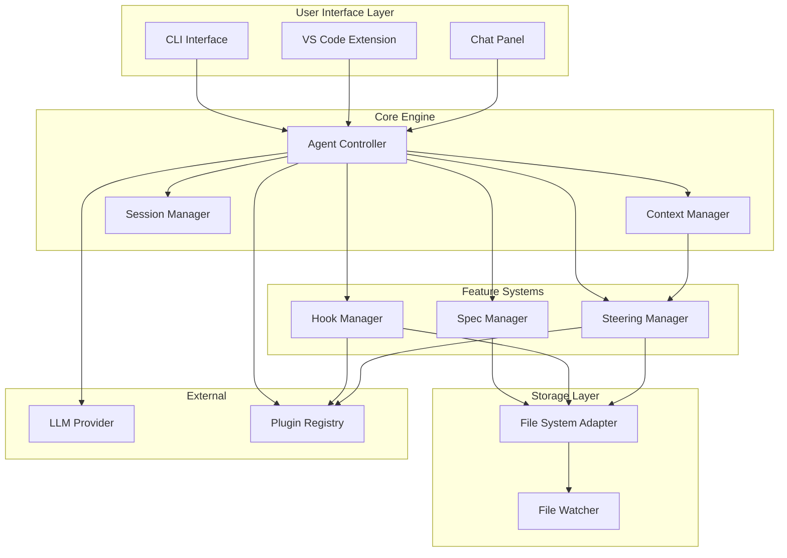

# Design Document: Open-Kiro

## Overview

Open-Kiro is an open-source AI-assisted development tool built around three core capabilities: specs, hooks, and steering. The system operates as a VS Code extension (or standalone CLI) that integrates with AI language models to provide structured, iterative feature development workflows.

The architecture follows a modular design with clear separation between:
- **Core Engine**: Orchestrates agent interactions and manages state
- **Spec System**: Handles the requirements → design → tasks workflow
- **Hook System**: Manages event-driven automation
- **Steering System**: Provides contextual AI guidance
- **Storage Layer**: Persists configurations in human-readable formats

## Architecture



## Components and Interfaces

### 1. Agent Controller

The central orchestrator that processes user messages and coordinates responses.

```typescript
interface AgentController {
  // Process a user message and generate a response
  processMessage(message: UserMessage): Promise<AgentResponse>;
  
  // Execute a specific task from a spec
  executeTask(specName: string, taskId: string): Promise<TaskResult>;
  
  // Get current session state
  getSession(): Session;
  
  // Register event listeners
  on(event: AgentEvent, handler: EventHandler): void;
}

interface UserMessage {
  content: string;
  attachments?: FileReference[];
  context?: ContextOverride;
}

interface AgentResponse {
  content: string;
  codeChanges?: CodeChange[];
  status: 'success' | 'error' | 'pending_approval';
}
```

### 2. Spec Manager

Manages the lifecycle of specs including creation, updates, and state tracking.

```typescript
interface SpecManager {
  // Create a new spec with the given name
  createSpec(name: string): Promise<Spec>;
  
  // Load an existing spec
  loadSpec(name: string): Promise<Spec>;
  
  // List all specs in the workspace
  listSpecs(): Promise<SpecSummary[]>;
  
  // Update a specific document within a spec
  updateDocument(specName: string, docType: DocType, content: string): Promise<void>;
  
  // Get task status for a spec
  getTaskStatus(specName: string): Promise<TaskStatus[]>;
  
  // Update task status
  setTaskStatus(specName: string, taskId: string, status: TaskState): Promise<void>;
}

type DocType = 'requirements' | 'design' | 'tasks';
type TaskState = 'not_started' | 'in_progress' | 'completed';

interface Spec {
  name: string;
  path: string;
  requirements: string | null;
  design: string | null;
  tasks: Task[] | null;
}

interface Task {
  id: string;
  description: string;
  status: TaskState;
  subTasks?: Task[];
  requirements?: string[];
}
```

### 3. Hook Manager

Handles hook registration, event listening, and action execution.

```typescript
interface HookManager {
  // Register a new hook
  registerHook(hook: HookConfig): Promise<void>;
  
  // Remove a hook
  removeHook(hookId: string): Promise<void>;
  
  // List all registered hooks
  listHooks(): Promise<HookConfig[]>;
  
  // Manually trigger a hook
  triggerHook(hookId: string, context?: HookContext): Promise<HookResult>;
  
  // Enable/disable a hook
  setHookEnabled(hookId: string, enabled: boolean): Promise<void>;
}

interface HookConfig {
  id: string;
  name: string;
  trigger: HookTrigger;
  action: HookAction;
  enabled: boolean;
  conditions?: HookCondition[];
}

type HookTrigger = 
  | { type: 'file_save'; pattern?: string }
  | { type: 'message_sent' }
  | { type: 'session_created' }
  | { type: 'agent_complete' }
  | { type: 'manual' };

type HookAction =
  | { type: 'send_message'; message: string }
  | { type: 'execute_command'; command: string; cwd?: string };

interface HookResult {
  success: boolean;
  output?: string;
  error?: string;
}
```

### 4. Steering Manager

Manages steering files and determines which content to include in agent context.

```typescript
interface SteeringManager {
  // Load all steering files from workspace
  loadSteeringFiles(): Promise<SteeringFile[]>;
  
  // Get steering content for current context
  getActiveSteeringContent(context: SteeringContext): Promise<string>;
  
  // Create a new steering file
  createSteeringFile(name: string, config: SteeringConfig): Promise<void>;
  
  // Update steering file content
  updateSteeringFile(name: string, content: string): Promise<void>;
  
  // Resolve file references in steering content
  resolveReferences(content: string): Promise<string>;
}

interface SteeringFile {
  name: string;
  path: string;
  content: string;
  config: SteeringConfig;
}

interface SteeringConfig {
  inclusion: 'always' | 'fileMatch' | 'manual';
  fileMatchPattern?: string;
  description?: string;
}

interface SteeringContext {
  activeFiles: string[];
  manualInclusions: string[];
}
```

### 5. Context Manager

Builds and manages the context provided to the LLM.

```typescript
interface ContextManager {
  // Build full context for an agent request
  buildContext(request: ContextRequest): Promise<AgentContext>;
  
  // Add a file to context
  addFile(path: string): Promise<void>;
  
  // Add a folder to context
  addFolder(path: string, depth?: number): Promise<void>;
  
  // Clear current context
  clearContext(): void;
}

interface ContextRequest {
  message: string;
  spec?: string;
  taskId?: string;
  explicitFiles?: string[];
  explicitFolders?: string[];
}

interface AgentContext {
  systemPrompt: string;
  steeringContent: string;
  specContext?: SpecContext;
  fileContents: FileContent[];
  conversationHistory: Message[];
}
```

### 6. File System Adapter

Abstracts file system operations for testability and cross-platform support.

```typescript
interface FileSystemAdapter {
  // Read file content
  readFile(path: string): Promise<string>;
  
  // Write file content
  writeFile(path: string, content: string): Promise<void>;
  
  // Check if path exists
  exists(path: string): Promise<boolean>;
  
  // Create directory recursively
  mkdir(path: string): Promise<void>;
  
  // List directory contents
  readdir(path: string): Promise<string[]>;
  
  // Watch for file changes
  watch(pattern: string, callback: WatchCallback): Disposable;
  
  // Delete file or directory
  delete(path: string): Promise<void>;
}
```

### 7. Plugin System

Enables extensibility through a plugin architecture.

```typescript
interface PluginRegistry {
  // Register a plugin
  register(plugin: Plugin): Promise<void>;
  
  // Unregister a plugin
  unregister(pluginId: string): Promise<void>;
  
  // Get all registered plugins
  getPlugins(): Plugin[];
  
  // Get plugin by ID
  getPlugin(pluginId: string): Plugin | undefined;
}

interface Plugin {
  id: string;
  name: string;
  version: string;
  
  // Lifecycle hooks
  activate(context: PluginContext): Promise<void>;
  deactivate(): Promise<void>;
  
  // Optional extensions
  hookTriggers?: CustomHookTrigger[];
  steeringModes?: CustomSteeringMode[];
  commands?: Command[];
}

interface PluginContext {
  workspacePath: string;
  registerHookTrigger(trigger: CustomHookTrigger): void;
  registerSteeringMode(mode: CustomSteeringMode): void;
  registerCommand(command: Command): void;
}
```

## Data Models

### Spec File Structure

```
.kiro/specs/{feature-name}/
├── requirements.md    # EARS-formatted requirements
├── design.md          # Technical design document
└── tasks.md           # Implementation task checklist
```

### Hook Configuration Schema

```typescript
// Stored in .kiro/hooks/{hook-name}.json
interface HookFile {
  id: string;
  name: string;
  description?: string;
  trigger: {
    type: string;
    config?: Record<string, unknown>;
  };
  action: {
    type: 'send_message' | 'execute_command';
    message?: string;
    command?: string;
    cwd?: string;
  };
  enabled: boolean;
  conditions?: Array<{
    type: string;
    value: string;
  }>;
}
```

### Steering File Format

```markdown
---
inclusion: fileMatch
fileMatchPattern: "**/*.ts"
description: TypeScript coding standards
---

# TypeScript Standards

When working with TypeScript files:
- Use strict mode
- Prefer interfaces over types for object shapes
- Reference: #[[file:tsconfig.json]]
```

### Task List Format

```markdown
# Implementation Plan

- [ ] 1. First task
  - Details about the task
  - _Requirements: 1.1, 1.2_

- [ ] 2. Second task
  - [ ] 2.1 Sub-task one
    - _Requirements: 2.1_
  - [ ] 2.2 Sub-task two
    - _Requirements: 2.2_
```


## Correctness Properties

*A property is a characteristic or behavior that should hold true across all valid executions of a system-essentially, a formal statement about what the system should do. Properties serve as the bridge between human-readable specifications and machine-verifiable correctness guarantees.*

### Property 1: Spec Directory Creation

*For any* valid feature name, when a spec is created, the system should create a directory at `.kiro/specs/{feature_name}/` containing exactly three files: `requirements.md`, `design.md`, and `tasks.md`.

**Validates: Requirements 1.1**

### Property 2: Spec Workflow State Transitions

*For any* spec in the "requirements" phase, the system should not advance to the "design" phase until explicit user approval is received. Similarly, *for any* spec in the "design" phase, the system should not advance to the "tasks" phase until explicit approval is received.

**Validates: Requirements 1.3, 1.4, 1.5**

### Property 3: Hook Persistence Round-Trip

*For any* valid hook configuration, saving the hook and then loading it should produce an equivalent configuration object.

**Validates: Requirements 2.1**

### Property 4: Hook Trigger Execution

*For any* enabled hook with a matching trigger event, when that event occurs, the hook's action should be executed exactly once.

**Validates: Requirements 2.2**

### Property 5: Hook Action Types

*For any* hook with action type "send_message", execution should result in the message being sent to the agent. *For any* hook with action type "execute_command", execution should result in the command being run.

**Validates: Requirements 2.3, 2.4**

### Property 6: Hook Failure Isolation

*For any* hook that fails during execution, the failure should be logged and should not propagate exceptions to the caller or block other operations.

**Validates: Requirements 2.5**

### Property 7: Steering File Parsing Round-Trip

*For any* valid steering file with front-matter and content, parsing and then serializing should produce equivalent content.

**Validates: Requirements 3.1**

### Property 8: Steering Inclusion - Always

*For any* steering file with `inclusion: always` (or no front-matter), the steering content should be included in the agent context regardless of which files are active.

**Validates: Requirements 3.2**

### Property 9: Steering Inclusion - FileMatch

*For any* steering file with `inclusion: fileMatch` and a pattern, the steering content should be included if and only if at least one active file matches the pattern.

**Validates: Requirements 3.3**

### Property 10: Steering Inclusion - Manual

*For any* steering file with `inclusion: manual`, the steering content should be included if and only if the user explicitly references it.

**Validates: Requirements 3.4**

### Property 11: Steering Reference Resolution

*For any* steering content containing `#[[file:<path>]]` references, resolving the content should replace each reference with the actual file content at that path.

**Validates: Requirements 3.5**

### Property 12: Task Execution Context Loading

*For any* task being executed, the system should load the associated spec's requirements.md and design.md into the agent context before execution begins.

**Validates: Requirements 4.1**

### Property 13: Task Status Updates

*For any* task, starting execution should set status to "in_progress", and completing execution should set status to "completed". The tasks.md file should reflect these changes.

**Validates: Requirements 4.2, 4.3**

### Property 14: Sub-Task Ordering Constraint

*For any* task with sub-tasks, the parent task status should not be "completed" while any sub-task status is not "completed".

**Validates: Requirements 4.4**

### Property 15: Configuration Loading at Startup

*For any* workspace with existing configurations (specs, hooks, steering files), starting the system should load all configurations into memory.

**Validates: Requirements 5.1, 5.2, 5.3**

### Property 16: Configuration Hot Reload

*For any* configuration file modified externally while the system is running, the system should detect the change and reload the configuration within a reasonable time window.

**Validates: Requirements 5.4**

### Property 17: Configuration Format Compliance

*For any* saved configuration, specs and steering files should be valid Markdown, and hooks should be valid JSON.

**Validates: Requirements 5.5**

### Property 18: Context Reference Resolution

*For any* user message containing `#File` or `#Folder` references, the referenced content should be included in the agent context.

**Validates: Requirements 6.2, 6.3**

### Property 19: Code Change Approval Gate

*For any* code changes generated by the agent, the changes should not be applied to the filesystem until the user explicitly approves them.

**Validates: Requirements 6.4, 6.5**

### Property 20: Plugin Lifecycle

*For any* registered plugin, the plugin's `activate` method should be called at startup, and `deactivate` should be called on unregistration.

**Validates: Requirements 7.1, 7.5**

### Property 21: Plugin Extension Registration

*For any* plugin that defines custom hook triggers or steering modes, those extensions should be available for use after the plugin is activated.

**Validates: Requirements 7.2, 7.3**

### Property 22: Plugin Failure Isolation

*For any* plugin that fails to load or activate, the system should log the error and continue operating with all other functionality intact.

**Validates: Requirements 7.4**

## Error Handling

### File System Errors

| Error | Handling Strategy |
|-------|-------------------|
| File not found | Return null/undefined, log warning, allow graceful degradation |
| Permission denied | Throw descriptive error, notify user with remediation steps |
| Disk full | Throw error, notify user, prevent partial writes |
| Invalid path | Validate paths before operations, throw on invalid input |

### Hook Execution Errors

| Error | Handling Strategy |
|-------|-------------------|
| Command timeout | Kill process after configurable timeout, log error, continue |
| Command failure | Log exit code and stderr, mark hook execution as failed |
| Invalid hook config | Skip hook, log validation error, notify user |

### Plugin Errors

| Error | Handling Strategy |
|-------|-------------------|
| Plugin load failure | Log error, skip plugin, continue with core functionality |
| Plugin runtime error | Catch and log, disable plugin if repeated failures |
| Plugin conflict | Log warning, use first-registered extension |

### Steering/Spec Parsing Errors

| Error | Handling Strategy |
|-------|-------------------|
| Invalid YAML front-matter | Use defaults, log warning |
| Missing referenced file | Log warning, omit reference, continue |
| Malformed markdown | Best-effort parsing, log issues |

## Testing Strategy

### Unit Testing

Unit tests will cover:
- Individual component methods in isolation
- Edge cases for parsing (empty files, malformed content)
- File system adapter operations
- Hook condition evaluation
- Steering pattern matching

Framework: **Vitest** (fast, TypeScript-native, compatible with VS Code extension testing)

### Property-Based Testing

Property-based tests will verify the correctness properties defined above using **fast-check** library.

Each property test will:
- Generate random valid inputs using smart generators
- Execute the operation under test
- Verify the property holds
- Run minimum 100 iterations per property
- Be tagged with the property number and requirements reference

Example generator strategies:
- **Feature names**: Alphanumeric strings with hyphens, 1-50 chars
- **Hook configs**: Valid combinations of trigger types and action types
- **Steering files**: Valid markdown with optional YAML front-matter
- **File paths**: Valid relative paths within workspace bounds
- **Task lists**: Nested checkbox structures with valid IDs

### Integration Testing

Integration tests will verify:
- End-to-end spec workflow (create → requirements → design → tasks)
- Hook trigger → action execution flow
- Steering file loading and context inclusion
- Plugin registration and extension availability
- File watcher responsiveness

### Test Organization

```
src/
├── spec-manager/
│   ├── spec-manager.ts
│   └── spec-manager.test.ts      # Unit + property tests
├── hook-manager/
│   ├── hook-manager.ts
│   └── hook-manager.test.ts
├── steering-manager/
│   ├── steering-manager.ts
│   └── steering-manager.test.ts
└── __tests__/
    └── integration/              # Integration tests
        ├── spec-workflow.test.ts
        ├── hook-execution.test.ts
        └── plugin-system.test.ts
```
